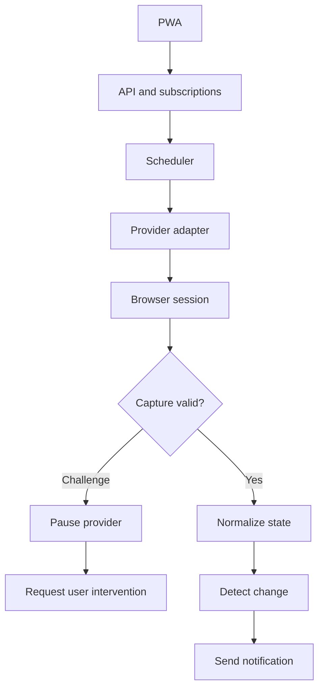

# Architecture

## Status

This document describes the intended architecture. The production system and first provider adapter have not yet been implemented.

## High-level flow

## Main components

### PWA

Collects the minimum information required to create and manage a monitoring subscription. Location access is optional; users must also be able to select a center manually.

### API and subscription store

Validates subscription requests and stores only the data required for monitoring and notification. Identical monitoring targets should share a provider check where possible.

### Scheduler

Runs provider checks at responsible intervals. It must support backoff, jitter, pausing, and provider-specific limits.

### Provider adapter

Translates provider-specific behavior into a normalized internal state. Each provider requires separate feasibility, reliability, and policy review.

### Browser session

May be used when the public appointment application cannot be reliably accessed through standard HTTP requests. A browser session is not permission to bypass CAPTCHA, Cloudflare, rate limits, or other access controls.

### Capture validation

Confirms that a response belongs to the intended appointment application and is complete enough to interpret. A protection page, CAPTCHA, error page, incomplete load, or unexpected structure is not an availability result.

### State normalization

Converts valid provider data into a common model. The initial model is expected to distinguish at least:

- `SLOTS_AVAILABLE`
- `NO_SLOTS`
- `CAPTCHA_REQUIRED`
- `RATE_LIMITED`
- `BLOCKED`
- `UNKNOWN`
- `ERROR`

Only a valid, recognized provider response may produce `NO_SLOTS`.

### Change detection and notifications

Compares the current normalized state with the previous valid state. Notifications should be sent for meaningful changes while avoiding repeated alerts for the same result.

## Safety boundaries

- The monitor does not book or confirm appointments.
- CAPTCHA and anti-bot challenges are not bypassed.
- A challenge pauses the affected monitoring flow and may require user intervention.
- Passport numbers and document details are not required for availability monitoring.
- Raw browser profiles, cookies, tokens, fingerprints, and unprocessed network captures must not be committed to the public repository.
- `BLOCKED`, `UNKNOWN`, `ERROR`, and incomplete captures must never be converted to `NO_SLOTS`.
