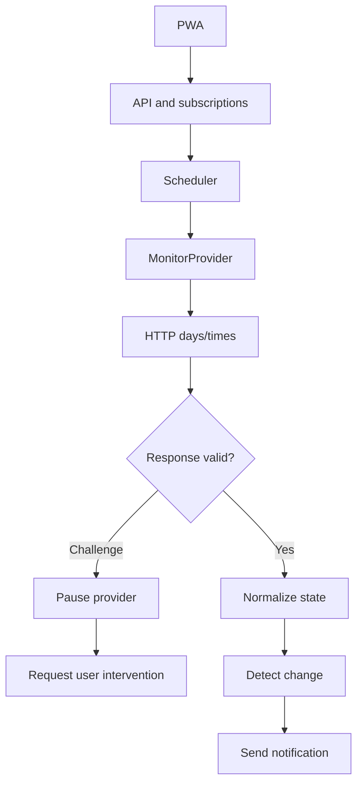
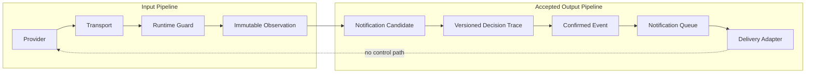
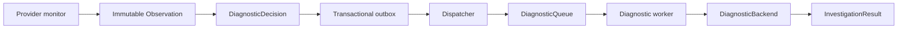

# Architecture

## Status

This document separates the implemented local prototype from the intended
service architecture. The Observation/outbox/diagnostic infrastructure,
landing classifier, provider boundaries, seventeen independent monitor entry
points, process runner, and seventeen registry-enabled public-discovery
profiles are implemented. Subscriptions, external notification delivery, and
user-facing service infrastructure are not.

## Intended service flow (planned)


```mermaid
flowchart TD
    U["PWA"] --> API["API and subscriptions"]
    API --> S["Scheduler"]
    S --> A["MonitorProvider"]
    A --> H["HTTP days/times"]
    H --> V{"Response valid?"}
    V -->|Yes| N["Normalize state"]
    V -->|Challenge| P["Pause provider"]
    P --> I["Request user intervention"]
    N --> D["Detect change"]
    D --> M["Send notification"]
```

## Main components

### PWA

Collects the minimum information required to create and manage a monitoring subscription. Location access is optional; users must also be able to select a center manually.

### API and subscription store

Validates subscription requests and stores only the data required for monitoring and notification. Identical monitoring targets should share a provider check where possible.

### Scheduler

Runs provider checks at responsible intervals. It must support backoff, jitter, pausing, and provider-specific limits.

### MonitorProvider

Translates provider-specific behavior into a normalized internal state. Each provider requires separate feasibility, reliability, and policy review.

DP Document frontend 7.34.2 uses the public HTTP flow:

```text
Service -> days -> times
```

MonitorProvider is the protocol contract and has no fingerprint, identity,
OTP, BankID, Diia, reservation, or browser dependency. `CityMonitor` performs
transport orchestration without broadening that contract.

The HTTP adapter exposes landing, `days`, and `times` operations. Twelve
governance-approved profiles execute the complete public sequence. Kortrijk
remains landing-only until equivalent centre-specific evidence and governance
approval exist.

The provider protocol is an evidence-first state machine, not an unconditional
request sequence:

```text
HTTP response
    |
    v
LandingPageClassifier
    |
    v
LandingPageResult(state, csrf, queue_form, evidence)
    |
    v
TransitionGuard
```

The trust boundary governing how observations and candidate research material
may become configured provider capabilities is defined by
[ADR-0011](DECISIONS.md#adr-0011-trust-model-for-evidence-collection-and-capability-governance).
The current per-deployment trust state is maintained separately in the
[Evidence Matrix](EVIDENCE_MATRIX.md); it is not runtime configuration.

A confirmed no-slots marker may terminate at `LANDING`. Only a valid form and
CSRF permit `SERVICE_VALIDATION` and `DAYS`; only confirmed dates permit
`TIMES`. Unknown, blocked, maintenance, or authentication evidence terminates
safely without additional requests.

Berlin live evidence also confirms a distinct valid terminal path:

```text
LANDING -> DAYS (1) -> TIMES (0) -> NO_SLOTS -> STOP
```

Therefore `NO_SLOTS` records the confirmed absence of usable public time
entries at the stage reached; it is not exclusively a landing-page state.
Later Berlin evidence for the same allowed date reached `TIMES` with nine
entries and `SLOTS_AVAILABLE`, confirming that a post-discovery state may
change without changing the public state-machine boundary.

Across the ten currently evidence-confirmed deployments, a cycle may stop at
a recognized landing-level `NO_SLOTS` marker or continue through the guarded
public contract. When `TIMES` is reached, its recognized contents determine
`NO_SLOTS` or `SLOTS_AVAILABLE`. This is an evidence-bounded comparison, not a
universal protocol guarantee.

The evidence-gated runtime path is:

```text
LANDING -> DAYS -> TIMES -> STOP
```

Each enabled profile uses only its confirmed centre, service, opaque
CSRF-field semantics, and strict response schemas. Any unexpected status,
HTML, JSON shape, field type, or date/time representation terminates discovery
as `UNKNOWN`.
At `TIMES`, normalized counts and earliest/latest allowed public time entries
are recorded, then monitoring stops. There is no transition into identity,
CAPTCHA, fingerprinting, reservation, or booking.

For explicitly configured landing-only research centres, ADR-0011 permits a
separate opt-in candidate evidence probe after HTTP `BLOCKED`. It performs one
persistent-browser landing navigation for a new
`(provider_id, transport, page_hash)` key under cooldown, records only
sanitized form candidates in Git-ignored `research-output/`, and stops at
`LANDING`. It cannot select a service or enable `DAYS`/`TIMES`.

### BookingProvider

Reserved for separately approved future work. No implementation exists. It
must remain independent so booking-specific fingerprint or identity
requirements can never become monitoring dependencies.

### Browser transport and diagnostics

HTTP remains preferred. An opt-in research fallback allows the ten currently
registry-enabled research profiles to use a persistent Playwright context
only after HTTP is `BLOCKED`.
It follows the same confirmed state machine and stops at `TIMES`.
A browser challenge remains `BLOCKED`; it is never interacted with or
bypassed.

Site Investigator remains separately queued diagnostics and does not produce
the fallback Observation.

The 2026-08-02 six-hour release validation exercised the four newly governed
profiles with two established controls. Every confirmed browser-discovery
execution either reached `TIMES` or stopped at a recognized earlier
`NO_SLOTS` boundary; no browser error or browser `UNKNOWN` was recorded.

### Capture validation

Confirms that a response belongs to the intended appointment application and is complete enough to interpret. A protection page, CAPTCHA, error page, incomplete load, or unexpected structure is not an availability result.

### State normalization

Converts valid provider data into the implemented common runtime states:

- `SLOTS_AVAILABLE`
- `POSSIBLE_SLOTS`
- `NO_SLOTS`
- `CAPTCHA_REQUIRED`
- `BLOCKED`
- `UNKNOWN`
- `ERROR`

Only a valid, recognized provider response may produce `NO_SLOTS`.

### Change detection and notifications

Planned external service behavior. The prototype records state transitions and
diagnostic decisions, but no Telegram, email, or end-user notification sender
is implemented. The accepted one-way Output Pipeline is specified by
[ADR-0012](DECISIONS.md#adr-0012-evidence-first-notification-derivation-and-output-isolation)
and [Notification Architecture](NOTIFICATION_ARCHITECTURE.md).


```mermaid
flowchart LR
    subgraph INPUT["Input Pipeline"]
        P["Provider"] --> T["Transport"]
        T --> G["Runtime Guard"]
        G --> O["Immutable Observation"]
    end

    subgraph OUTPUT["Accepted Output Pipeline"]
        O --> C["Notification Candidate"]
        C --> D["Versioned Decision Trace"]
        D --> E["Confirmed Event"]
        E --> Q["Notification Queue"]
        Q --> A["Delivery Adapter"]
    end

    A -. "no control path" .-> P
```

ADR-0012 keeps notification derivation outside provider processes.
Policies consume committed Observations but never schedule observations. The
Coordinator performs orchestration only; priority and audience remain
independent; adapters receive privacy-validated envelopes rather than
Observation or provider objects. Notification decisions and delivery audit
are separate immutable records.

The offline domain implements immutable contracts, fail-closed Policy Set
loading, append-only Decision Trace construction, and pure confirmation
replay. A separately governed persistence slice implements immutable Delivery
Jobs plus local SQLite job/state storage. Job content is isolated from mutable
status, lease, and bounded retry metadata. Worker, adapter, Telegram,
Observation access, notification generation, and runtime integration remain
unimplemented. Observation v3, provider runtime, diagnostics, and trusted
capabilities remain unchanged.

### Architecture protection CI

The initial CI milestone enforces architecture before notification runtime
exists. Focused AST-based guards reject notification imports from provider or
diagnostic runtime, provider imports from the notification Output Pipeline,
writes from notification code to `providers.json`, and reverse dependencies
between classified notification layers. The guards now validate the offline
`notifications/` package.

The same guard also protects the independent `engineering_telemetry/` package.
Engineering telemetry stores local aggregate development and infrastructure
facts for cost analysis. It imports neither providers, monitor runtime,
diagnostics, nor notifications; it cannot observe or alter Runtime Guard,
provider capability, or delivery behavior. Its local SQLite database and
automatic audit output are runtime artifacts. Reviewed aggregate reports may
be committed only after privacy review.

Repository hygiene is checked separately against tracked runtime artifacts,
generated outputs, sensitive filenames, and high-confidence secret formats.
Documentation is excluded from content secret matching so legitimate security,
privacy, CSRF, cookie, and Telegram terminology is not treated as a leak.

These checks protect dependency direction and repository boundaries only.
They do not interpret evidence, approve capabilities, accept ADR-0012, or
implement notification policy.

## Safety boundaries

- The monitor does not book or confirm appointments.
- CAPTCHA and anti-bot challenges are not bypassed.
- A challenge pauses the affected monitoring flow and may require user intervention.
- Passport numbers and document details are not required for availability monitoring.
- Raw browser profiles, cookies, tokens, fingerprints, and unprocessed network captures must not be committed to the public repository.
- `BLOCKED`, `UNKNOWN`, `ERROR`, and incomplete captures must never be converted to `NO_SLOTS`.

## Optional diagnostic investigations

Monitoring never invokes a diagnostic backend synchronously. Every provider
check first creates an immutable, schema-versioned Observation. Observation,
DiagnosticDecision, and an optional transactional outbox record are persisted
atomically. A dispatcher delivers accepted snapshot requests to the diagnostic
queue, and a separately supervised worker executes them through a replaceable
DiagnosticBackend.


```mermaid
flowchart LR
    M["Provider monitor"] --> O["Immutable Observation"]
    O --> D["DiagnosticDecision"]
    D --> X["Transactional outbox"]
    X --> P["Dispatcher"]
    P --> Q["DiagnosticQueue"]
    Q --> W["Diagnostic worker"]
    W --> B["DiagnosticBackend"]
    B --> R["InvestigationResult"]
```

The dispatcher knows only `DispatchTarget`; the queue knows only immutable
snapshot requests and safe results. Neither component knows about Site
Investigator, Playwright, Chromium, HAR, screenshots, or video. SQLite is the
initial persistent implementation and an in-memory implementation is used for
contract tests.

Queue jobs use priority ordering, cooldown, active-job deduplication, bounded
leases, lease tokens, expired-lease recovery, and retry states. The
orchestrator supplies one `run_id` to all processes in its session.

The complete versioned contract is documented in
`docs/contracts/observation-diagnostics.md`.

Monitoring and diagnostic collection are separate processes. A monitor may
request an investigation through an immutable outbox snapshot, but it does not
invoke Site Investigator code or manage browser profiles,
cookies, storage, HAR files, network dumps, tokens, session data, or other
diagnostic artifacts.

The Site Investigator adapter launches a configured external CLI and returns
only the safe `InvestigationResult` contract to the worker: success,
investigation ID, exit code, external output directory, and a coarse
capture-quality summary. Stdout and stderr are captured internally by the
adapter but are never exposed to, logged by, or persisted by monitors. The
adapter is disabled when
`SITE_INVESTIGATOR_COMMAND` is unset. Supported configuration:

- `SITE_INVESTIGATOR_COMMAND`: executable and optional fixed arguments;
- `SITE_INVESTIGATOR_CWD`: optional external project working directory;
- `SITE_INVESTIGATOR_OUTPUT_ROOT`: optional external artifact root;
- `SITE_INVESTIGATOR_MODE`: investigation mode, default `research`;
- `SITE_INVESTIGATOR_TIMEOUT_SECONDS`: bounded process timeout, default `300`;
- `DIAGNOSTIC_BACKEND`: backend selector, default `site-investigator`;
- `KORTRIJK_DIAGNOSTIC_EVENTS`: comma-separated events to investigate.

The configured command receives `--url`, `--provider`, `--event`, and `--mode`.
It also receives a generated `--investigation-id` and a unique `--output`
directory. When `SITE_INVESTIGATOR_OUTPUT_ROOT` is omitted, output defaults to
`research/monitor-investigations` under `SITE_INVESTIGATOR_CWD`. At least one of
those location settings is required so diagnostic artifacts cannot accidentally
be written into the monitor project.
An event is requested only on entry into that state; unchanged states do not
create repeated decisions. A same-state page hash change can emit
`HTML_STRUCTURE_CHANGED`. Queue cooldown and deduplication prevent redundant
active jobs. Backend failures are represented as safe queue results or retry
state without exposing stdout or stderr, and monitoring continues.

Every Observation contains classifier reason, transport, response timing,
HTTP status, page hash, and correlation identifiers. Recovery from `BLOCKED`,
`CAPTCHA_REQUIRED`, `UNKNOWN`, or `ERROR` to a recognized queue state remains
identified explicitly as a restored queue page.

When an operator stops the monitor with `Ctrl+C`, the process records
`Monitoring stopped manually` with `reason=manual_interrupt` and exits with
status `130`. This creates an explicit session boundary in the log before the
next monitor start.

After all supervised processes stop, the orchestrator invokes the local
Research Summary Generator for the shared `run_id`. By default, runs shorter
than one hour are skipped. The generator reads immutable Observations from
SQLite and writes a Git-ignored Markdown runtime report; it does not read
browser profiles, raw HTML, cookies, headers, or captures. Generation can be
disabled with `RESEARCH_SUMMARY_ENABLED=false`, and the threshold can be
changed with `RESEARCH_SUMMARY_MINIMUM_HOURS`.

The immutable records form a correlation chain through `run_id`,
`observation_id`, `decision_id`, and `investigation_id`. The accepted decision
receives its investigation ID before outbox delivery, so dispatcher, queue,
worker, backend result, and output directory use the same value. This allows an
event to be associated with its backend-managed artifact directory without
opening diagnostic captures.

Example PowerShell configuration for Site Investigator 2.0.6:

```powershell
$env:DIAGNOSTIC_BACKEND = "site-investigator"
$env:SITE_INVESTIGATOR_CWD = "D:\Tools\site-investigator"
$env:SITE_INVESTIGATOR_COMMAND = "npm.cmd run investigate -- --max-pages 2 --concurrency 1"
$env:SITE_INVESTIGATOR_MODE = "research"
$env:KORTRIJK_DIAGNOSTIC_EVENTS = "BLOCKED,UNKNOWN,HTML_STRUCTURE_CHANGED,QUEUE_SECTION_CHANGED"
```

Browser profiles, headed mode, challenge waiting, cookies, storage, HAR, and
network-capture policy are intentionally absent from monitor configuration.
When needed, those remain explicit Site Investigator concerns and must not be
added to the monitor or its state file.
