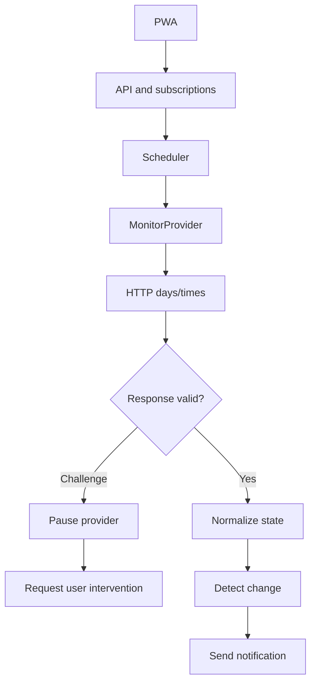
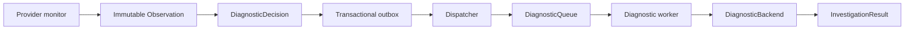

# Architecture

## Status

This document separates the implemented local prototype from the intended
service architecture. The Observation/outbox/diagnostic infrastructure,
landing classifier, provider boundaries, three monitor entry points, and
process runner are implemented. Subscriptions, notifications, and complete
live-validated `days`/`times` discovery are not.

## Intended service flow (planned)


```mermaid
flowchart TD
    U["PWA"] --> API["API and subscriptions"]
    API --> S["Scheduler"]
    S --> A["MonitorProvider"]
    A --> H["HTTP days/times"]
    H --> V{"Response valid?"}
    V -->|Yes| N["Normalize state"]
    V -->|Challenge| P["Pause provider"]
    P --> I["Request user intervention"]
    N --> D["Detect change"]
    D --> M["Send notification"]
```

## Main components

### PWA

Collects the minimum information required to create and manage a monitoring subscription. Location access is optional; users must also be able to select a center manually.

### API and subscription store

Validates subscription requests and stores only the data required for monitoring and notification. Identical monitoring targets should share a provider check where possible.

### Scheduler

Runs provider checks at responsible intervals. It must support backoff, jitter, pausing, and provider-specific limits.

### MonitorProvider

Translates provider-specific behavior into a normalized internal state. Each provider requires separate feasibility, reliability, and policy review.

DP Document frontend 7.34.2 uses the public HTTP flow:

```text
Service -> days -> times
```

MonitorProvider has no fingerprint, identity, OTP, BankID, Diia, reservation,
or browser dependency.

The HTTP adapter exposes landing, `days`, and `times` operations. The current
city monitor loops use the landing classifier but do not yet execute the
adapter's complete discovery sequence. Consequently, the existence of these
methods is not evidence that day/time response normalization or live
multi-centre discovery is complete.

The provider protocol is an evidence-first state machine, not an unconditional
request sequence:

```text
HTTP response
    |
    v
LandingPageClassifier
    |
    v
LandingPageResult(state, csrf, queue_form, evidence)
    |
    v
TransitionGuard
```

A confirmed no-slots marker terminates at `LANDING`. Only a valid form and
CSRF permit `SERVICE_VALIDATION` and `DAYS`; only confirmed dates permit
`TIMES`. Unknown, blocked, maintenance, or authentication evidence terminates
safely without additional requests.

### BookingProvider

Reserved for separately approved future work. No implementation exists. It
must remain independent so booking-specific fingerprint or identity
requirements can never become monitoring dependencies.

### Browser diagnostics

Browser automation is not part of normal provider discovery. Site Investigator
may use a browser only in the separately queued diagnostic and
reverse-engineering subsystem. A challenge is evidence for `BLOCKED`, not
permission to bypass provider controls.

### Capture validation

Confirms that a response belongs to the intended appointment application and is complete enough to interpret. A protection page, CAPTCHA, error page, incomplete load, or unexpected structure is not an availability result.

### State normalization

Converts valid provider data into a common model. The initial model is expected to distinguish at least:

- `SLOTS_AVAILABLE`
- `NO_SLOTS`
- `CAPTCHA_REQUIRED`
- `RATE_LIMITED`
- `BLOCKED`
- `UNKNOWN`
- `ERROR`

Only a valid, recognized provider response may produce `NO_SLOTS`.

### Change detection and notifications

Planned service behavior. The prototype records state transitions and
diagnostic decisions, but no Telegram, email, or end-user notification sender
is implemented.

## Safety boundaries

- The monitor does not book or confirm appointments.
- CAPTCHA and anti-bot challenges are not bypassed.
- A challenge pauses the affected monitoring flow and may require user intervention.
- Passport numbers and document details are not required for availability monitoring.
- Raw browser profiles, cookies, tokens, fingerprints, and unprocessed network captures must not be committed to the public repository.
- `BLOCKED`, `UNKNOWN`, `ERROR`, and incomplete captures must never be converted to `NO_SLOTS`.

## Optional diagnostic investigations

Monitoring never invokes a diagnostic backend synchronously. Every provider
check first creates an immutable, schema-versioned Observation. Observation,
DiagnosticDecision, and an optional transactional outbox record are persisted
atomically. A dispatcher delivers accepted snapshot requests to the diagnostic
queue, and a separately supervised worker executes them through a replaceable
DiagnosticBackend.


```mermaid
flowchart LR
    M["Provider monitor"] --> O["Immutable Observation"]
    O --> D["DiagnosticDecision"]
    D --> X["Transactional outbox"]
    X --> P["Dispatcher"]
    P --> Q["DiagnosticQueue"]
    Q --> W["Diagnostic worker"]
    W --> B["DiagnosticBackend"]
    B --> R["InvestigationResult"]
```

The dispatcher knows only `DispatchTarget`; the queue knows only immutable
snapshot requests and safe results. Neither component knows about Site
Investigator, Playwright, Chromium, HAR, screenshots, or video. SQLite is the
initial persistent implementation and an in-memory implementation is used for
contract tests.

Queue jobs use priority ordering, cooldown, active-job deduplication, bounded
leases, lease tokens, expired-lease recovery, and retry states. The
orchestrator supplies one `run_id` to all processes in its session.

The complete versioned contract is documented in
`docs/contracts/observation-diagnostics.md`.

Monitoring and diagnostic collection are separate processes. A monitor may
request an investigation through an immutable outbox snapshot, but it does not
invoke Site Investigator code or manage browser profiles,
cookies, storage, HAR files, network dumps, tokens, session data, or other
diagnostic artifacts.

The Site Investigator adapter launches a configured external CLI and returns
only the safe `InvestigationResult` contract to the worker: success,
investigation ID, exit code, external output directory, and a coarse
capture-quality summary. Stdout and stderr are captured internally by the
adapter but are never exposed to, logged by, or persisted by monitors. The
adapter is disabled when
`SITE_INVESTIGATOR_COMMAND` is unset. Supported configuration:

- `SITE_INVESTIGATOR_COMMAND`: executable and optional fixed arguments;
- `SITE_INVESTIGATOR_CWD`: optional external project working directory;
- `SITE_INVESTIGATOR_OUTPUT_ROOT`: optional external artifact root;
- `SITE_INVESTIGATOR_MODE`: investigation mode, default `research`;
- `SITE_INVESTIGATOR_TIMEOUT_SECONDS`: bounded process timeout, default `300`;
- `DIAGNOSTIC_BACKEND`: backend selector, default `site-investigator`;
- `KORTRIJK_DIAGNOSTIC_EVENTS`: comma-separated events to investigate.

The configured command receives `--url`, `--provider`, `--event`, and `--mode`.
It also receives a generated `--investigation-id` and a unique `--output`
directory. When `SITE_INVESTIGATOR_OUTPUT_ROOT` is omitted, output defaults to
`research/monitor-investigations` under `SITE_INVESTIGATOR_CWD`. At least one of
those location settings is required so diagnostic artifacts cannot accidentally
be written into the monitor project.
An event is requested only on entry into that state; unchanged states do not
create repeated decisions. A same-state page hash change can emit
`HTML_STRUCTURE_CHANGED`. Queue cooldown and deduplication prevent redundant
active jobs. Backend failures are represented as safe queue results or retry
state without exposing stdout or stderr, and monitoring continues.

Every Observation contains classifier reason, transport, response timing,
HTTP status, page hash, and correlation identifiers. Recovery from `BLOCKED`,
`CAPTCHA_REQUIRED`, `UNKNOWN`, or `ERROR` to a recognized queue state remains
identified explicitly as a restored queue page.

When an operator stops the monitor with `Ctrl+C`, the process records
`Monitoring stopped manually` with `reason=manual_interrupt` and exits with
status `130`. This creates an explicit session boundary in the log before the
next monitor start.

The immutable records form a correlation chain through `run_id`,
`observation_id`, `decision_id`, and `investigation_id`. The accepted decision
receives its investigation ID before outbox delivery, so dispatcher, queue,
worker, backend result, and output directory use the same value. This allows an
event to be associated with its backend-managed artifact directory without
opening diagnostic captures.

Example PowerShell configuration for Site Investigator 2.0.6:

```powershell
$env:DIAGNOSTIC_BACKEND = "site-investigator"
$env:SITE_INVESTIGATOR_CWD = "D:\Tools\site-investigator"
$env:SITE_INVESTIGATOR_COMMAND = "npm.cmd run investigate -- --max-pages 2 --concurrency 1"
$env:SITE_INVESTIGATOR_MODE = "research"
$env:KORTRIJK_DIAGNOSTIC_EVENTS = "BLOCKED,UNKNOWN,HTML_STRUCTURE_CHANGED,QUEUE_SECTION_CHANGED"
```

Browser profiles, headed mode, challenge waiting, cookies, storage, HAR, and
network-capture policy are intentionally absent from monitor configuration.
When needed, those remain explicit Site Investigator concerns and must not be
added to the monitor or its state file.
