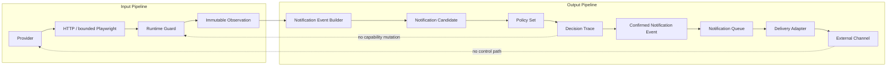
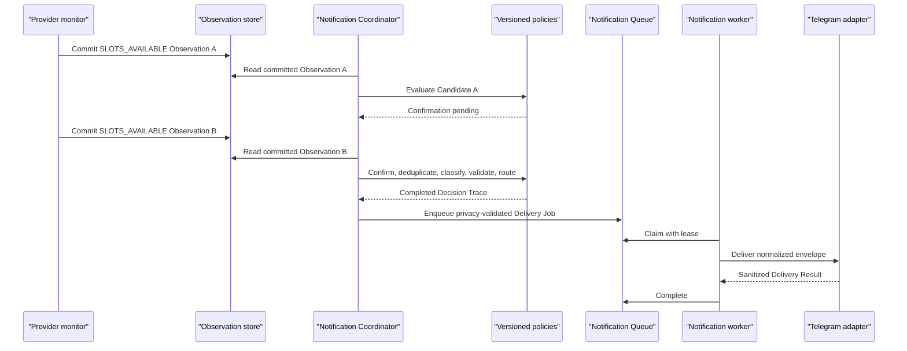
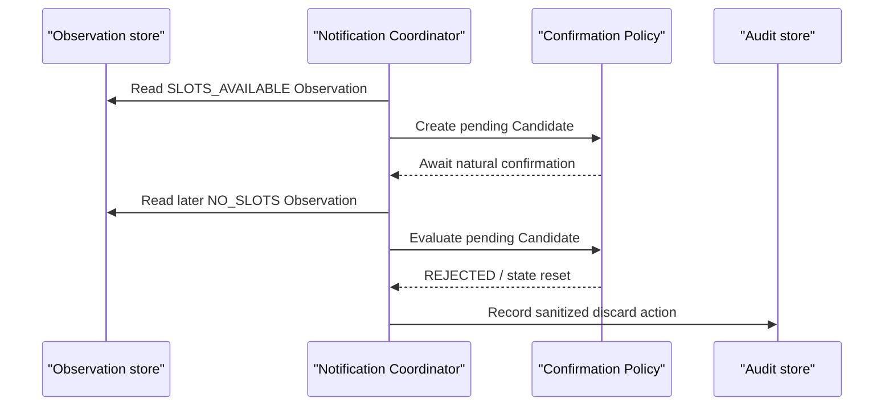

# Notification Architecture

> **Status:** Accepted; offline domain, Delivery Job persistence, and local Worker implemented
>
> Immutable contracts, Policy Set loading, Decision Trace, pure offline replay,
> and the separately authorized SQLite Delivery Job Store and caller-driven
> local Worker are implemented. No Coordinator, scheduler, external delivery
> adapter, Telegram API call, Observation reader, subscription store, runtime
> hook, or external message exists.

## Purpose

This document specifies the evidence-first Output Pipeline accepted in
[ADR-0012](DECISIONS.md#adr-0012-evidence-first-notification-derivation-and-output-isolation).
It complements the trust model in
[ADR-0011](DECISIONS.md#adr-0011-trust-model-for-evidence-collection-and-capability-governance)
without extending provider runtime capabilities.

> **Output capabilities are governed with the same discipline as runtime
> capabilities, while remaining an independent architecture.**

The accepted offline package deliberately remains flat:

```text
notifications/
    contracts.py
    decisions.py
    policy_loader.py
    replay.py
    __init__.py
```

Replay is a pure function over explicit candidate/source facts, the loaded
Policy Set, and immutable retained decision state. It uses no singleton,
dependency-injection container, service locator, repository, queue, or runtime
callback. A Decision Trace is an append-only tuple; replay returns a new tuple
and never mutates the retained one.

## Information-flow boundary



The Input Pipeline converts current public provider responses into committed,
immutable runtime facts. The Output Pipeline converts eligible facts into
bounded external communications. Information moves in one direction only.

The Output Pipeline cannot:

- schedule or accelerate a provider check;
- start HTTP, Playwright, or diagnostics;
- modify an Observation;
- modify `providers.json` or the Evidence Matrix;
- promote, revise, or remove a capability;
- change Runtime Guard decisions;
- perform identity, CAPTCHA, reservation, or booking actions.

## Pipeline

```text
Committed Observation
    -> Notification Event Builder
    -> Notification Candidate
    -> Confirmation Policy
    -> Notification Decision
    -> Confirmed Notification Event
    -> Deduplication Policy
    -> Priority Policy
    -> Privacy Policy
    -> Routing Policy
    -> Notification Queue
    -> Notification Worker
    -> Delivery Adapter
    -> Delivery Result
    -> Notification Audit
```

### Observation reader

The proposed Notification Coordinator reads committed Observations from the
existing local source-of-truth database through a durable processing cursor.
Provider processes do not call the Coordinator and do not import notification
code.

At-least-once candidate evaluation plus persisted deduplication is preferred
over synchronous monitor-to-channel delivery. External exactly-once delivery
cannot be guaranteed when a process may stop after a channel accepts a message
but before local completion is committed.

### Event builder

The Event Builder maps an Observation to zero or more sanitized Candidates.
It copies only explicitly allowlisted public fields. It never serializes an
Observation wholesale and never passes arbitrary dictionaries to later
components.

### Confirmation policy

A Candidate does not authorize delivery. Confirmation evaluates subsequent
naturally occurring Observations according to a versioned policy:

- minimum observations;
- minimum duration;
- maximum window;
- required state and discovery stage;
- consecutive-observation requirement;
- reset states.

Provider-specific notification-policy overrides belong only in notification
configuration. They do not change provider runtime configuration.

> **Confirmation policies consume observations but never schedule them.**

### Deduplication policy

Deduplication is evaluated only after confirmation. It may suppress or
aggregate equivalent events using a configurable silence or aggregation
window. It is independent from confirmation: confirmation asks whether a fact
is sufficiently supported; deduplication asks whether an equivalent confirmed
fact has already been communicated.

### Priority and audience

Priority and audience are independent dimensions.

| Priority | Meaning | Proposed handling |
|---|---|---|
| P0 | Confirmed critical fact | Immediate after confirmation |
| P1 | Operational warning | Short configurable delay |
| P2 | Information | Batched delivery |
| P3 | Debug | Developer-only and disabled by default |

Initial audiences are `developer`, `research`, and future `public`. Routing,
not priority, selects audience, channel, and a destination alias.

### Privacy policy

Privacy policy validates a normalized event before queue insertion and a
rendered envelope immediately before delivery. Unknown fields and unsupported
schemas fail closed.

Allowed public facts are limited to:

- public provider or centre label;
- public service label;
- normalized state and discovery stage;
- observation time;
- aggregate available-date and allowed-time-entry counts;
- earliest and latest public available time;
- official public URL;
- coarse, allowlisted reason code.

Forbidden data includes:

- cookies, CSRF values, headers, authorization data, or request bodies;
- browser storage, profile paths, raw HTML, screenshots, HAR, or trace data;
- phone numbers, OTP, CAPTCHA, identity, or booking data;
- bot tokens, raw destination identifiers, or arbitrary exception bodies.

### Routing policy

Routing produces immutable Delivery Jobs for configured audiences and
channels. Destination aliases refer to environment-variable names or another
future secret resolver; resolved identifiers are not domain-event fields.

### Queue and worker

The implemented local SQLite Delivery Job Store exposes `enqueue`, `claim`,
`complete`, and `fail`, with:

- priority ordering;
- active-job deduplication;
- bounded leases and lease-token validation;
- expired-lease recovery;
- bounded retry backoff;
- terminal failure.

It remains separate from DiagnosticQueue.

The governance-authorized persistence slice stores immutable Delivery Jobs
separately from mutable status, lease, and bounded retry metadata. A lease does
not alter the job. The caller supplies the logical event's `dedup_key` and
already classified priority; SQLite performs idempotency and ordering only.
The separately authorized local Worker claims one job, invokes a local
`DeliveryPort.deliver(job) -> DeliveryResult`, then settles the state through
`complete` or `fail`. It is caller-driven: it has no scheduler, background
loop, runtime hook, Observation access, SQL, or network code. Store lease
expiry remains the crash-recovery mechanism for a process that stops after a
claim. A deliberately in-memory fake adapter is the only adapter implemented
in this slice.

### Delivery adapter

A Delivery Adapter receives only an immutable, privacy-validated
`NotificationDeliveryJob` and returns a small `DeliveryResult`: `SUCCESS`,
`RETRYABLE_FAILURE`, or `PERMANENT_FAILURE`, with a sanitized reason for a
failure. It receives no Store, SQLite connection, lease token, claim time, or
retry-count data. Telegram is the first planned external adapter. Future
email, Discord, webhook, and push adapters implement the same boundary
without changing provider runtime or policy evaluation.

An adapter cannot decide confirmation, deduplication, priority, audience, or
governance. It returns a sanitized Delivery Result to the worker.

## Policy Sets

A Policy Set is the governance unit for Output Pipeline rules. It references
independently versioned confirmation, deduplication, priority, privacy, and
routing policies.

```text
Policy Set
├── Confirmation Policy
├── Deduplication Policy
├── Priority Policy
├── Privacy Policy
└── Routing Policy
```

Every logical decision records:

- Policy Set ID and version;
- safe normalized Policy Set hash;
- policy ID and version for the evaluated stage;
- reason code and outcome;
- source Candidate and Observation references.

Credentials and resolved destination identifiers are excluded from Policy Set
hashes and persisted policy snapshots.

## Decisions, provenance, and audit

### Notification Decision

A Notification Decision records the logical outcome of one policy stage:
`PENDING`, `ACCEPTED`, `REJECTED`, `EXPIRED`, or `SUPPRESSED`. Confirmation,
deduplication, priority, privacy, and routing produce distinct decisions.

### Decision Trace

All decisions for one Candidate and one Policy Set share a
`decision_trace_id` and unique sequence numbers. This reconstructs the logical
chain without creating a mutable aggregate.

```text
1. Confirmation  -> ACCEPTED
2. Deduplication -> ACCEPTED
3. Priority      -> P0
4. Privacy       -> ACCEPTED
5. Routing       -> developer / telegram
```

### Provenance

A Confirmed Notification Event retains sanitized provenance: source
Observation IDs, Candidate ID, confirmation count and interval, evaluation
time, and referenced policy versions and hashes.

### Audit

Audit records operational actions such as queued, claimed, delivered,
retry-scheduled, failed, privacy-rejected, or configuration-rejected. Audit is
append-only and does not change the Decision Trace or source facts.

An accepted routing decision and a successful delivery are different facts.
A channel rate limit may follow an accepted decision without invalidating it.

## Decision reproducibility

Given retained source facts, deterministic ordering, the referenced Policy
Set, evaluation time, and relevant retained confirmation and deduplication
state, replay must produce the same normalized logical Decision Trace without
provider runtime or delivery infrastructure.

Replay compares semantic values, including stages, outcomes, reason codes,
priority, routes, provenance, and policy references. Newly generated IDs,
test execution timestamps, channel responses, and operational audit records
are excluded.

## Coordinator invariant

> **The Notification Coordinator performs orchestration only.**

It may invoke components in the defined order, persist decisions, advance a
cursor, and enqueue accepted routes. It cannot contain provider, event,
confirmation, deduplication, priority, privacy, routing, channel, or message
formatting rules.

Architecture tests should enforce that:

- Coordinator imports policy protocols, not Telegram;
- Telegram does not import Observation;
- notification policies do not import provider monitors;
- notification modules cannot write trusted provider configuration;
- adapters receive envelopes rather than Observations.

## Source-fact boundary

Provider availability notifications derive from Observation. Orchestrator or
governance information such as run completion, summary generation, and review
reminders are not provider Observations. Supporting them requires a separate,
immutable Operational Fact contract and governance review.

## Failure model

| Failure | Required result |
|---|---|
| Unsupported Candidate or event schema | Reject locally; no delivery |
| Unknown Policy Set or policy version | Reject locally; no delivery |
| Unconfirmed or expired Candidate | Discard; no delivery |
| Active deduplication window | Record suppression; no delivery |
| Privacy allowlist failure | Reject before queue or delivery |
| Queue process interruption | Recover through lease expiry |
| Adapter rate limit | Safe bounded retry if configured |
| Missing credential or destination | Terminal configuration failure |
| Delivery failure | Monitoring and source Observation remain unaffected |

Configuration failures must not recursively create external notifications.

## Sequence: confirmed availability



## Sequence: transient candidate



## Proposed directory boundary

```text
notifications/
├── domain.py
├── builder.py
├── confirmation.py
├── deduplication.py
├── priority.py
├── privacy.py
├── routing.py
├── coordinator.py
├── queue.py
├── worker.py
├── audit_store.py
├── config.py
└── adapters/
    └── telegram.py
```

This directory does not exist as runtime implementation at this milestone.

## Implementation order after governance approval

```text
Offline immutable contracts
    -> schema validation
    -> Policy Set loading
    -> pure policy decisions
    -> Decision Trace replay
    -> architecture tests
    -> memory queue and fake adapter
    -> SQLite queue and worker
    -> developer-only Telegram adapter
    -> bounded runtime integration
```

Public notifications require a later privacy and governance review covering
opt-in, opt-out, destination retention, deletion, fan-out, abuse controls, and
third-party processing.
