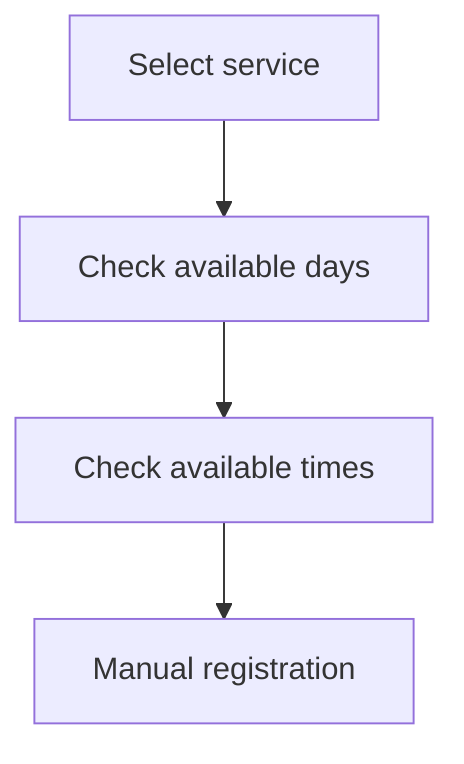

# DP Document Queue Workflow Research

**Location under study:** Kortrijk, Belgium

**Status:** Provider feasibility research

**Last updated:** 2026-07-21

## Purpose

This study evaluates whether appointment availability can be monitored responsibly without automatic booking, CAPTCHA bypass, or collection of passport details.

## Confirmed observations

- A standard direct HTTP request may receive `403 Forbidden`.
- The public appointment application can be reached through a normal browser session.
- The publicly delivered client application exposes the general appointment workflow.
- The observed workflow contains separate stages for service selection, available days, available times, and manual registration.
- Access restrictions, CAPTCHA pages, incomplete captures, and application errors require states distinct from `NO_SLOTS`.

## Generalized workflow

## In progress

- capturing a valid live response for available days;
- capturing a valid live response for time slots;
- identifying the minimum stable browser-session requirements;
- defining a normalized provider response;
- determining responsible polling, backoff, and pause behavior.

## Not yet implemented

- a production provider adapter;
- persistent session management;
- automated availability-change detection;
- user challenge-intervention flow;
- notification delivery based on real provider changes.

## Safety boundary

This public note intentionally excludes internal module identifiers, operation names, form-field inventories, request payloads, session values, fingerprints, CAPTCHA tokens, raw captures, and detailed request-reproduction instructions.

The research describes what has been established, not a recipe for interacting with undocumented provider internals.
