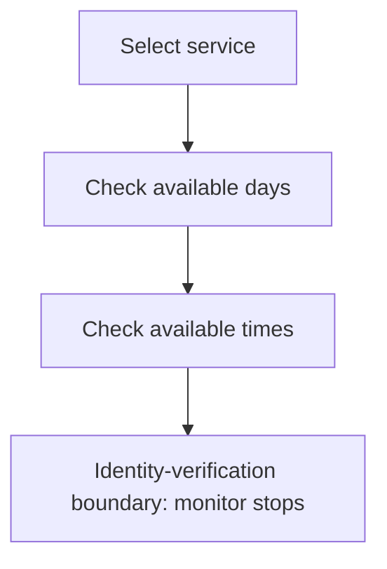

# DP Document Queue Workflow Research

**Location under study:** Kortrijk, Belgium

**Status:** Provider feasibility research

**Last updated:** 2026-07-30

> **Supersession note — 2026-07-31:** The “In progress” and implementation
> status sections below describe the earlier landing-only stage. Strict
> days/times classifiers and terminal `TIMES` discovery are now implemented
> for Madrid, Barcelona, London, and Milan. HTTP remains the preferred first
> transport; an explicitly enabled experimental Playwright fallback may run
> after HTTP `BLOCKED` for those confirmed profiles only. Other centres remain
> evidence-gated. The historical text is retained to preserve research
> chronology.

## Purpose

This study evaluates whether appointment availability can be monitored responsibly without automatic booking, CAPTCHA bypass, or collection of passport details.

## Confirmed observations

- A standard direct HTTP request may receive `403 Forbidden`.
- Frontend 7.34.2 exposes pre-authentication HTTP queue discovery through
  `form=days` and `form=times`.
- Queue discovery requires service centre, service, CSRF, and date for times;
  it does not require a browser fingerprint.
- The publicly delivered client application exposes the general appointment workflow.
- The observed workflow contains separate stages for service selection, available days, available times, and manual registration.
- Access restrictions, CAPTCHA pages, incomplete captures, and application errors require states distinct from `NO_SLOTS`.

## User-provided live observation

On 2026-07-30, the project owner passively observed separate date and time
request steps in Bratislava and Milan, with time discovery following selection
of a date. This supports the high-level `dates -> times` abstraction but does
not confirm identical endpoints, fields, CSRF behavior, parameters, schemas,
or availability semantics.

The provenance, session window, and evidence limits are recorded in
[Bratislava and Milan Live Observation](2026-07-30-bratislava-milan-live-observation.md).
This evidence is distinct from repository tests and independently repeated
live validation.

## Generalized workflow

```mermaid
flowchart TD
    S["Select service"] --> D["Check available days"]
    D --> T["Check available times"]
    T --> I["Identity-verification boundary: monitor stops"]
```

## In progress

- capturing a valid live response for available days;
- capturing a valid live response for time slots;
- capturing the first identity-verification boundary without interacting with
  it;
- determining whether an explicit appointment count is public;
- validating centre-specific HTTP session, CSRF, and response schemas;
- defining a normalized provider response;
- determining responsible polling, backoff, and pause behavior.

## Implementation status

- an HTTP provider boundary with landing, `days`, and `times` methods exists;
- the configured local monitor loops classify landing responses and record state
  changes, but do not yet execute or normalize the complete `days`/`times`
  sequence;
- Observation, diagnostic decision, outbox, queue, worker, and process
  supervision infrastructure exists;
- production subscriptions and end-user notifications are not implemented;
- centre-specific session and CSRF behavior still requires live validation;
- user challenge-intervention flow;
- notification delivery based on real provider changes.

## Safety boundary

This public note excludes secrets, session values, generated fingerprints,
CAPTCHA tokens, raw captures, and booking-reproduction instructions. The
minimal public monitoring contract is documented because it contains no
authentication, personal data, or fingerprint parameter.

The research describes what has been established, not a recipe for interacting with undocumented provider internals.

The current evidence table and stage-dependent A/B conclusion are documented
in
[Pre-identity Appointment Calendar Research](2026-07-31-pre-identity-calendar-research.md).
